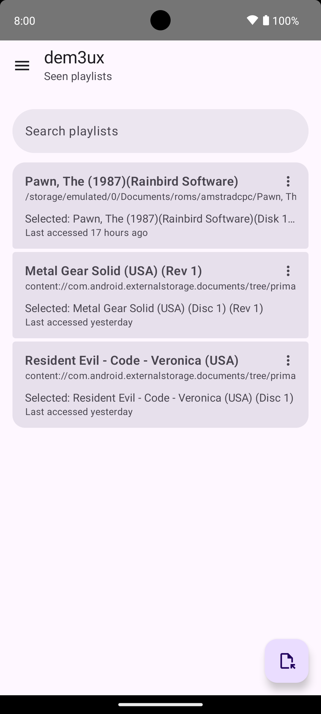
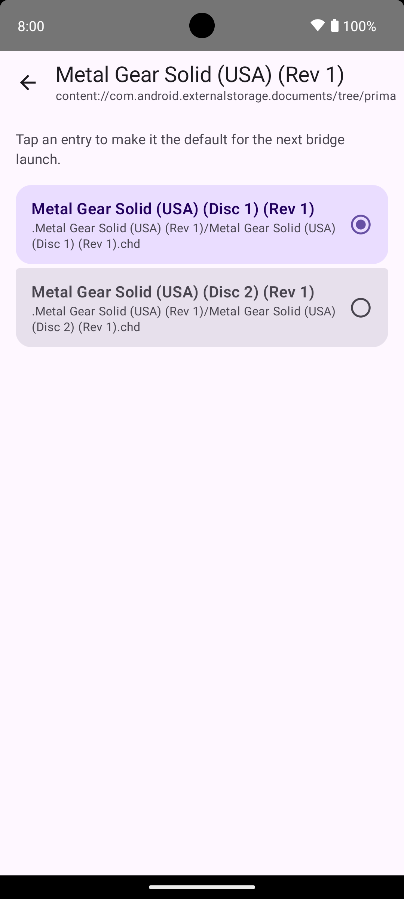
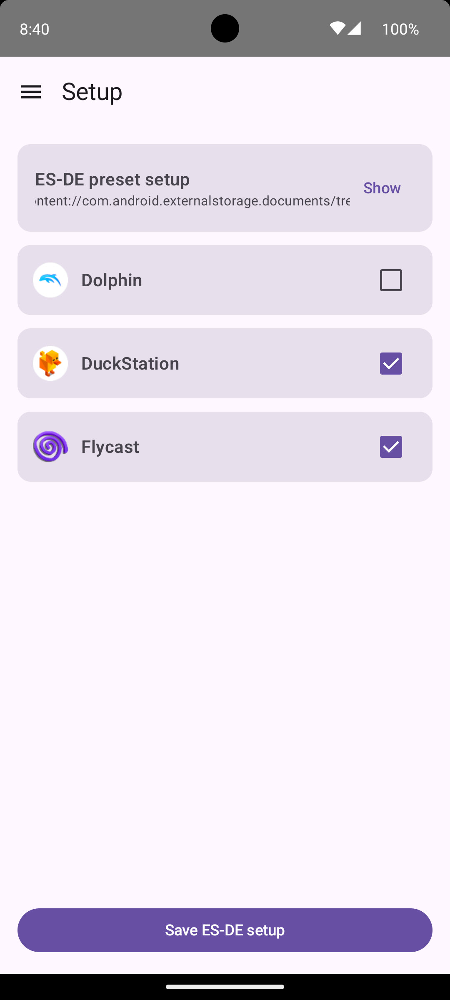

# dem3ux

<p align="center">
    
</p>

dem3ux is an Android `.m3u` demuxer and emulator launch bridge.

Its goal is to bridge launchers/frontends that launch `.m3u` playlists with emulators that do not directly support `.m3u` files and instead expect a concrete game image path.

The first target integration is [ES-DE](https://es-de.org/), but the project should stay frontend-agnostic where possible.

## Problem

Emulator frontends launch games by passing the selected ROM path to an Android emulator activity. For multi-disc systems, that selected ROM may be an `.m3u` playlist containing multiple disc/image entries.

Some emulators support `.m3u` directly. Others, such as [DuckStation](https://github.com/stenzek/duckstation) or [Flycast](https://github.com/flyinghead/flycast/) on Android, may need the frontend to pass a specific disc/image path instead.

dem3ux sits between the frontend and the emulator. For playlist inputs:

1. The frontend launches dem3ux with an `.m3u` path and target emulator information.
2. dem3ux parses the `.m3u` file.
3. dem3ux picks the last selected entry for that playlist (as chosen in its UI), or the first entry by default.
4. dem3ux converts that selected entry into the path/URI form expected by the target emulator.
5. dem3ux launches the target emulator activity.

For direct game/image inputs that are not `.m3u` playlists, dem3ux skips parsing and proxies the original path/URI to the target emulator unchanged. This supports frontends such as ES-DE that route an entire system directory through one Android launch command, regardless of individual file extension.

## Main Features

### Bridge Launch Mode

When launched by a frontend, dem3ux acts as a bridge:

- Accept a ROM path or URI from the frontend.
- Accept target emulator launch metadata.
- If the input is an `.m3u`, parse playlist entries.
- Resolve relative playlist entries against the `.m3u` location.
- Select the last-used entry for that playlist, or the first entry if no selection exists.
- If the input is not a playlist, proxy the original path/URI unchanged.
- Request and persist Android SAF folder access when required.
- Launch the target emulator with the selected entry or proxied direct input.

### App UI Mode

When launched as a regular Android app, dem3ux provides a small management UI:

- List `.m3u` playlists dem3ux has seen before.
- Allow manually adding a playlist that hasn't been requested by a frontend yet.
- Show the entries for each playlist.
- Let the user change the selected/default entry.
- Persist the selected entry so future bridge launches use it by default.
- Setup supported frontends to use dem3ux (currently limited to ES-DE).

<p align="center">
  
  
  
</p>

## Frontend Integration

Any frontend that uses Android intents to launch emulators should work with dem3ux, because dem3ux forwards the intent action, intent data, extras, and common activity flags it receives from the frontend to the emulator.

There are two ways to configure the bridge:

- Through bundled per-emulator [presets](https://github.com/aitorciki/dem3ux/blob/main/presets/bridge-presets.json): dem3ux knows how to forward specific intent context to many emulators supported by popular frontends, including data-based launches, extra-based launches, and known embedded path arguments. In this mode, dem3ux "impersonates" the actual emulator, and the frontend invokes dem3ux as if it was invoking the emulator. This is the recommended setup mechanism, as it requires very little manual integration. For some frontends (currently ES-DE) setup can be fully performed from inside dem3ux's UI.
- Manually, by creating a new emulator entry for dem3ux in your frontend, and providing the required parameters to identify the target emulator and playlist/game:
  - Frontends must be configured to use dem3ux's bridge activity instead of the emulator activity: `net.aitorciki.dem3ux/.BridgeActivity`.
  - `dem3ux.target.activity` extra (required): target emulator activity as a flattened Android component string, such as `com.github.stenzek.duckstation/.EmulationActivity`.
  - `dem3ux.input.path` extra (required): input playlist/game path or URI. Playlist inputs are demuxed; non-playlist inputs are proxied unchanged.
  - Intent data, all non-`dem3ux.` extras, and common activity flags such as clear task, clear top, and no history are forwarded to the target emulator under their original shape.
  - Any forwarded data value, string extra, or string-array item equal to `dem3ux.input.path` is replaced with the selected playlist entry, or with the original input for direct non-playlist launches.

When dem3ux receives a SAF/content URI, Android may require dem3ux to request access to the ROMs folder before it can read playlists or forward selected entries. This grant is persisted and reused for future launches.

### ES-DE Example

ES-DE Android reads custom configuration overrides from the `custom_systems` directory inside the `ES-DE` application data directory.

- `es_find_rules.xml`: maps emulator names to Android package/activity entries.
- `es_systems.xml`: defines systems and command strings that ES-DE converts into Android intents.

> [!NOTE]
> When creating an entry for a system in the custom `es_systems.xml`, the complete `<system>` entry from the [default list](https://gitlab.com/es-de/emulationstation-de/-/blob/master/resources/systems/android/es_systems.xml) must be copied: new command entries cannot be added to an existing system, the whole system needs to be replaced.

#### Preset Rules (a.k.a. Emulator Impersonation)

> [!NOTE]
> dem3ux can manage ES-DE's `es_find_rules.xml` updates from the app UI, so manual XML editing is usually not required.

For example, dem3ux can impersonate ES-DE's `DUCKSTATION` Android package rule for DuckStation. This keeps ES-DE's bundled `DuckStation (Standalone)` command unchanged, so only `es_find_rules.xml` needs a custom override. This is the entry dem3ux creates:

```xml
<emulator name="DUCKSTATION">
    <rule type="androidpackage">
        <entry>net.aitorciki.dem3ux/.presets.DuckStationBridgeActivity</entry>
    </rule>
</emulator>
```

The preset bridge reads DuckStation's native `bootPath` extra, demuxes `.m3u` inputs, and launches the real DuckStation activity with `bootPath` replaced by the selected playlist entry. Direct non-playlist images are proxied unchanged.

This preset is the preferred ES-DE integration path for [supported emulators](https://github.com/aitorciki/dem3ux/blob/main/presets/bridge-presets.json). The generic bridge configuration below remains useful for unsupported emulators or manual testing.

#### dem3ux Emulator Rule

In this approach, dem3ux is added as a new emulator to ES-DE's catalog, and then configured as the alternative emulator to use for selected systems.

This custom `es_find_rules.xml` entry lets ES-DE resolve dem3ux as an Android launch target:

```xml
<emulator name="DEM3UX">
    <rule type="androidpackage">
        <entry>net.aitorciki.dem3ux/.BridgeActivity</entry>
    </rule>
</emulator>
```

##### DuckStation Through dem3ux

The generic bridge path below is still supported, but the preset rule above avoids copying the full ES-DE system definition just to replace DuckStation.

The default [`es_find_rules.xml`](https://gitlab.com/es-de/emulationstation-de/-/blob/master/resources/systems/android/es_find_rules.xml) and [`es_systems.xml`](https://gitlab.com/es-de/emulationstation-de/-/blob/master/resources/systems/android/es_systems.xml) entries for `DuckStation (Standalone)` are:

```xml
<emulator name="DUCKSTATION">
  <rule type="androidpackage">
    <entry>com.github.stenzek.duckstation/.EmulationActivity</entry>
  </rule>
</emulator>
```

```xml
<command label="DuckStation (Standalone)">%EMULATOR_DUCKSTATION% %ACTIVITY_CLEAR_TASK% %ACTIVITY_CLEAR_TOP% %EXTRABOOL_resumeState%=false %EXTRA_bootPath%=%ROMSAF%</command>
```

The corresponding dem3ux variant launches dem3ux but keeps DuckStation's native extras for dem3ux to forward:

```xml
<command label="DuckStation (dem3ux)">%EMULATOR_DEM3UX% %ACTIVITY_CLEAR_TASK% %ACTIVITY_CLEAR_TOP% %EXTRA_dem3ux.target.activity%=com.github.stenzek.duckstation/.EmulationActivity %EXTRA_dem3ux.input.path%=%ROMSAF% %EXTRABOOL_resumeState%=false %EXTRA_bootPath%=%ROMSAF%</command>
```

- `%EMULATOR_DEM3UX%`: the bridge activity component as defined in `es_find_rules.xml`.
- `%EXTRA_dem3ux.target.activity%=com.github.stenzek.duckstation/.EmulationActivity`: the emulator activity from ES-DE's default `es_find_rules.xml`.
- `%EXTRA_dem3ux.input.path%=%ROMSAF%`: the playlist/game path dem3ux should demux or proxy.
- All other extras and common activity flags in the original command entry are copied as-is and forwarded to the emulator activity.

##### Flycast Through dem3ux

The generic bridge path below is still supported, but the preset rule above avoids copying the full ES-DE system definition just to replace Flycast.

Following the same process, Flycast's native ES-DE activity and command are:

```
com.flycast.emulator/com.flycast.emulator.MainActivity
```

and

```xml
<command label="Flycast (Standalone)">%EMULATOR_FLYCAST% %ACTION%=android.intent.action.VIEW %DATA%=%ROMSAF%</command>
```

The resulting custom command becomes:

```xml
<command label="Flycast (dem3ux)">%EMULATOR_DEM3UX% %ACTION%=android.intent.action.VIEW %DATA%=%ROMSAF% %EXTRA_dem3ux.target.activity%=com.flycast.emulator/com.flycast.emulator.MainActivity %EXTRA_dem3ux.input.path%=%ROMSAF%</command>
```

### Daijishō Example

[Daijishō](https://github.com/TapiocaFox/Daijishu) support has not yet been validated on device. The examples below are based on Daijishō's [documented](https://github.com/TapiocaFox/Daijishu/wiki/Start-Arguments-Cheat-Sheet) `am start`-style player arguments and [platform definitions](https://github.com/TapiocaFox/Daijishu/tree/main/platforms).

Through Daijishō's [player management functionality](https://github.com/TapiocaFox/Daijishou/wiki/How-to-Use-Daijish%C5%8D#players), existing players can be edited and custom ones created.

#### DuckStation Preset

Daijishō's native [DuckStation](https://github.com/TapiocaFox/Daijishou/blob/main/platforms/SonyPlayStation.json) player arguments are:

```text
-n com.github.stenzek.duckstation/.EmulationActivity
-e bootPath {file.uri}
--activity-clear-task
--activity-clear-top
```

To use dem3ux's DuckStation preset, just edit the player config and replace the component:

```text
-n net.aitorciki.dem3ux/.presets.DuckStationBridgeActivity
-e bootPath {file.uri}
--activity-clear-task
--activity-clear-top
```

This applies to other emulators with a corresponding dem3ux preset.

#### DuckStation Through dem3ux

In manual mode, the expected dem3ux variant is:

```text
-n net.aitorciki.dem3ux/.BridgeActivity
-e dem3ux.target.activity com.github.stenzek.duckstation/.EmulationActivity
-e dem3ux.input.path {file.uri}
-e bootPath {file.uri}
--ez resumeState 0
--activity-clear-task
--activity-clear-top
```

- `-e dem3ux.target.activity com.github.stenzek.duckstation/.EmulationActivity` identifies DuckStation as the target emulator.
- `-e dem3ux.input.path {file.uri}` gives dem3ux the playlist/game URI to demux or proxy.
- `-e bootPath {file.uri}` keeps DuckStation's native `bootPath` extra; dem3ux forwards it and replaces it with the selected playlist entry for `.m3u` inputs.
- Direct non-playlist images are proxied unchanged.

#### Flycast Through dem3ux

[Flycast](https://github.com/TapiocaFox/Daijishou/blob/main/platforms/Dreamcast.json) needs an explicit view action. The expected dem3ux player arguments are:

```text
-n net.aitorciki.dem3ux/.BridgeActivity
-a android.intent.action.VIEW
-d {file.uri}
-e dem3ux.target.activity com.flycast.emulator/com.flycast.emulator.MainActivity
-e dem3ux.input.path {file.uri}
```

- `-a android.intent.action.VIEW` applies to Daijishō launching dem3ux, and dem3ux preserves it when launching Flycast.
- `-d {file.uri}` keeps Flycast's native data-based launch shape; dem3ux replaces it with the selected playlist entry for `.m3u` inputs.

## Development

Run the full local verification task with:

```bash
./gradlew verify
```

This runs formatting checks, Android Lint, and unit tests.

To format Kotlin and Gradle Kotlin files:

```bash
./gradlew spotlessApply
```

The repository includes a pre-commit hook in `.githooks/pre-commit`. Enable it for a local clone with:

```bash
git config core.hooksPath .githooks
```

The hook runs `./gradlew verify` before each commit.

## License

dem3ux is licensed under the Apache License 2.0. See [LICENSE](LICENSE).
